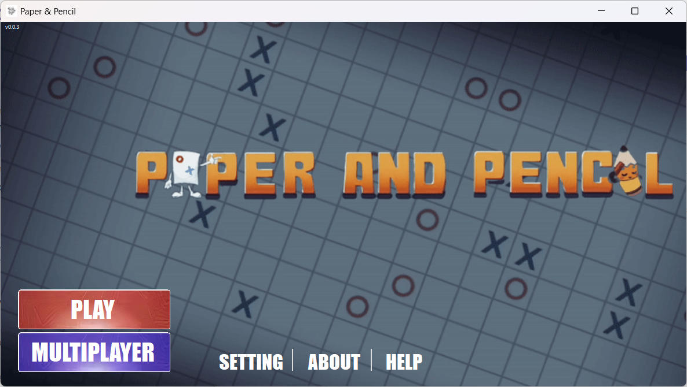
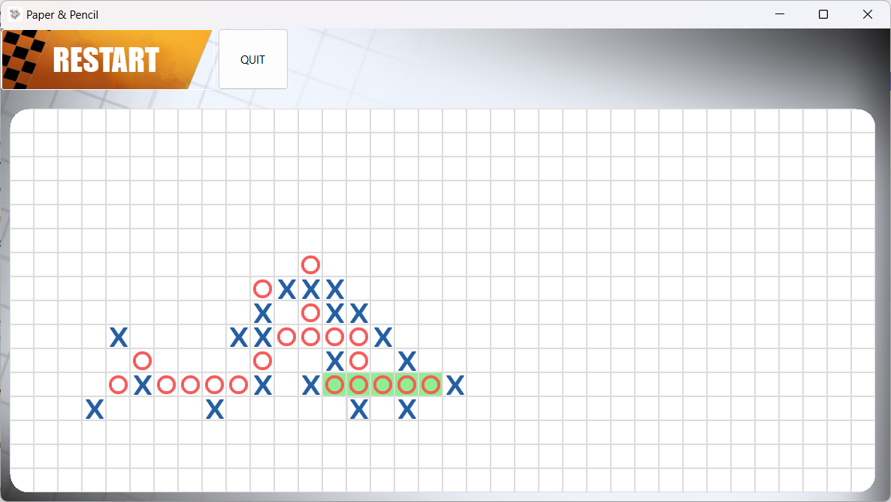
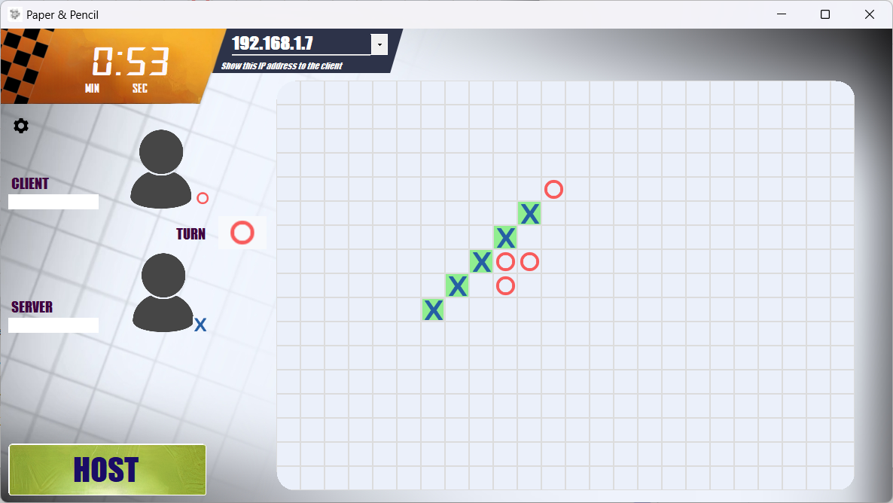
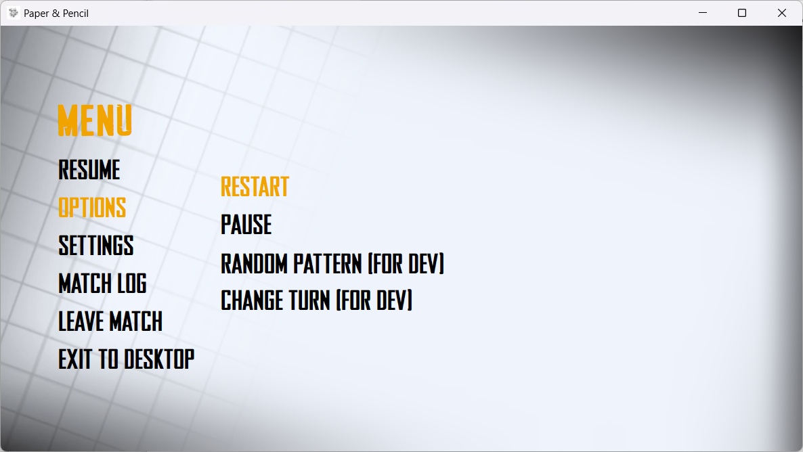

# LAN Caro Game (WinForm) | UIT - NT106.N21 Project - 05/2023

This is a LAN Caro game implemented using WinForm, a graphical user interface framework provided by Microsoft for creating Windows desktop applications. The LAN Caro game allows two players to compete against each other over a local area network (LAN) or play against a computer-controlled bot in single-player mode.

## Features
- Bot opponent: Play against a computer-controlled bot.
- LAN multiplayer: Play the game with another player over a local area network.
- WinForm GUI: The game interface is built using WinForm, providing a familiar and user-friendly experience.
- Grid board: The game is played on a grid board, where players take turns placing their markers.
- Win conditions: The objective is to be the first player to form a horizontal, vertical, or diagonal line of five markers.
- Time countdown: Added a timer to limit each player's turn duration.
- Turn-based gameplay: Players take turns placing their markers on the board.
## Technologies Used

- Programming language: C#
- Framework: .NET WinForms
- Networking: .NET Socket for LAN communication

## How to Run

1. Clone the repository to your local machine: `git clone https://github.com/dangphuc2470/LAN_Caro.git`
2. Open the solution file `LAN_Caro.sln` in Visual Studio.
3. Build the solution to compile the project.
4. Run the application from Visual Studio or locate the executable file in the output directory.

OR:
1. Download lastest zip file from the release page.
2. Extract it and open `LAN_Caro.exe` to play. 

Note: To run the program, you need to install the .NET runtime first. You can download and install it from [here](https://dotnet.microsoft.com/download).

## How to Play
1. Start the game:
   - Choose your role: Host or Client. If you want to choose the client role, you need to obtain the IP address of the host and fill it in the IP textbox first.
   - Click the "Ready" button if you are the client. If you are the host, wait for the client to indicate readiness. Once the client is ready, the play button will turn white, indicating that you can start the game.

2. Play the game by taking turns placing your markers on the board.

3. A timer will count down during your turn. If the time runs out, you will lose the game.

4. Access additional features by pressing ESC or clicking the gear icon. These features include restarting the game, viewing match logs, and exiting. The settings feature will be available in a future update.

5. Enjoy the LAN Caro game!

## Screenshots

<i>Main menu</i>

<i>Singleplayer</i>

<i>Multiplayer</i>

<i>In-game menu</i>

## Future Enhancements
- AI opponent: Enhance the computer-controlled BOT by implementing AI algorithms instead of relying on extensive for loops and if-else statements.
- Improved UI: Enhance the user interface with better performance.
- Online multiplayer: Extend the game to support online multiplayer gameplay.
- Score tracking: Implement a scoring system to keep track of wins and losses.
- Customization options: Allow players to choose their markers and customize the game settings.

## Contributing

Contributions are welcome! If you have any ideas for improvements or bug fixes, please submit a pull request.

## License

This project is licensed under the [MIT License](LICENSE).
